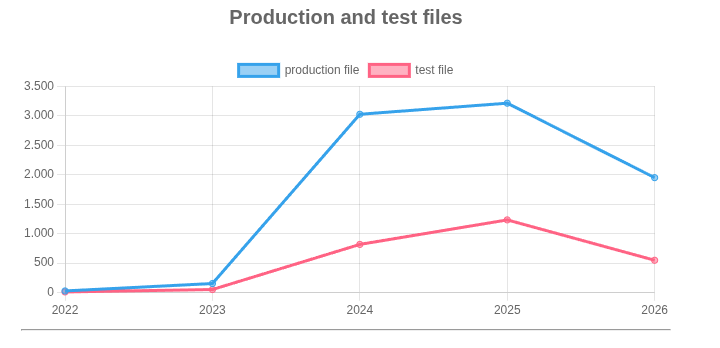

# Explorando evolução de código

Neste exercício, iremos explorar a evolução de código em sistemas reais.

Iremos utilizar a ferramenta [GitEvo](https://github.com/andrehora/gitevo).
Essa ferramenta analisa a evolução de código em repositórios Git nas linguagens Python, JavaScript, TypeScript e Java, e gera relatórios `HTML` como [este](https://andrehora.github.io/gitevo-examples/python/pandas.html).

Mais exemplos de relatórios podem ser podem ser encontrados em https://github.com/andrehora/gitevo-examples.

# Passo 1: Selecionar repositório a ser analisado

Selecione um repositório relevante na linguagem de sua preferência (Python, JavaScript, TypeScript ou Java).
Você pode encontrar projetos interessantes nos links abaixo:

- Python: https://github.com/topics/python?l=python
- JavaScript: https://github.com/topics/javascript?l=javascript
- TypeScript: https://github.com/topics/typescript?l=typescript
- Java: https://github.com/topics/java?l=java

# Passo 2: Instalar e rodar a ferramenta GitEvo

> [!NOTE]
> Antes de instalar a ferramenta, é recomendado criar e ativar um [ambiente virtual Python](https://packaging.python.org/en/latest/guides/installing-using-pip-and-virtual-environments/#create-and-use-virtual-environments).

Instale a ferramenta [GitEvo](https://github.com/andrehora/gitevo) com o comando:

```
$ pip install gitevo
```

Execute a ferramenta no repositório selecionado utilizando o comando abaixo (ajuste conforme a linguagem do repositório).
Substitua `<git_url>` pela URL do repositório que será analisado:

```shell
# Python
$ gitevo -r python <git_url>

# JavaScript
$ gitevo -r javascript <git_url>

# TypeScript
$ gitevo -r typescript <git_url>

# Java
$ gitevo -r java <git_url>
```

Por exemplo, para analisar o projeto Flask escrito em Python:

```
$ gitevo -r python https://github.com/pallets/flask
```

> [!NOTE]
> Essa etapa pode demorar alguns minutos pois o projeto será clonado e analisado localmente.

# Passo 3: Explorar o relatório de evolução de código

Após executar a ferramenta [GitEvo](https://github.com/andrehora/gitevo), é gerado um relatório `HTML` contendo diversos gráficos sobre a evolução do código.

Abra o relatório `HTML` e observe com atenção os gráficos.

# Passo 4: Explicar um gráfico de evolução de código

Selecione um dos gráficos de evolução e explique-o com suas palavras.
Por exemplo, você pode:

- Detalhar a evolução ao longo do tempo
- Detalhar se as curvas estão de acordo com boas práticas
- Explicar grandes alterações nas curvas
- Explorar a documentação do repositório em busca de explicações para grandes alterações
- etc.

Seja criativo!

# Instruções para o exercício

1. Crie um `fork` deste repositório (mais informações sobre forks [aqui](https://docs.github.com/pt/pull-requests/collaborating-with-pull-requests/working-with-forks/fork-a-repo)).
2. Adicione o relatório `HTML` no seu fork.
3. No Moodle, submeta apenas a URL do seu `fork`.

Responda às questões abaixo diretamente neste arquivo `README.md` do seu fork:

1. Repositório selecionado: https://github.com/langchain-ai/langchain
2. Gráfico selecionado: 
3. Explicação:

O gráfico evidencia uma evolução marcante no número de arquivos de produção e de teste ao longo do tempo, com crescimento discreto entre 2022 e 2023, seguido de um aumento abrupto entre 2023 e 2024. Esse salto coincide com a popularização dos grandes modelos de linguagem, que impulsionaram significativamente o desenvolvimento de frameworks como o LangChain. Nesse período, observa-se uma expansão acelerada do código de produção, provavelmente associada à incorporação de novas funcionalidades, integrações com diferentes provedores de modelos e experimentações típicas de um ecossistema em rápida evolução. A partir de 2024, o crescimento se mantém, porém em ritmo mais moderado, indicando um possível início de maturação do projeto.

Em relação aos arquivos de teste, embora haja crescimento ao longo do tempo, ele ocorre em proporção significativamente menor quando comparado ao código de produção. Essa diferença pode ser explicada não apenas pela velocidade de desenvolvimento, mas também pelas dificuldades inerentes ao teste de sistemas baseados em LLMs. Como esses modelos apresentam comportamento não determinístico, torna-se mais complexo de aplicar abordagens tradicionais de teste, exigindo métodos alternativos como avaliações qualitativas ou heurísticas. Além disso, parte relevante do código pode consistir em integrações e camadas intermediárias, que tendem a receber menos testes unitários convencionais. Esse cenário sugere uma priorização inicial de entrega de funcionalidades em detrimento da cobertura de testes.

Por fim, a queda observada entre 2025 e 2026 em ambas as curvas pode indicar uma mudança de fase no projeto, como processos de refatoração, remoção de código obsoleto ou reorganização arquitetural. Também é possível que o repositório tenha atingido um nível maior de estabilidade, reduzindo a necessidade de expansão contínua. No entanto, a manutenção de uma diferença significativa entre arquivos de produção e de teste ao longo de todo o período pode sinalizar a presença de dívida técnica, o que representa um risco potencial para a sustentabilidade e a evolução do projeto no longo prazo.


